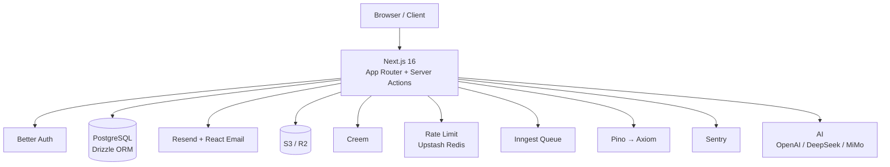

<p align="center">
  <br>
  
  <br>
  <h1 align="center">NextDevTpl</h1>
  <p align="center">
    The production-ready Next.js SaaS starter — launch your SaaS in hours, not weeks.
  </p>
  <p align="center">
    <a href="https://github.com/evepupil/NextDevTpl/blob/master/LICENSE">
      
    </a>
    <a href="https://nextjs.org/">
      
    </a>
    <a href="https://www.typescriptlang.org/">
      
    </a>
    <a href="https://tailwindcss.com/">
      
    </a>
    <a href="https://pnpm.io/">
      
    </a>
  </p>
  <p align="center">
    <a href="#-features">Features</a> •
    <a href="#-why-nextdevtpl">Why NextDevTpl?</a> •
    <a href="#-quick-start">Quick Start</a> •
    <a href="#-project-structure">Structure</a> •
    <a href="#-deployment">Deployment</a>
  </p>
</p>

---

## 🚀 Features

| Category | Highlights |
|----------|-----------|
| **Framework** | Next.js 16 (App Router, Turbopack), React 19, TypeScript |
| **Styling** | Tailwind CSS 4, Shadcn/UI, Radix UI, dark mode |
| **Database** | PostgreSQL, Drizzle ORM, Neon serverless |
| **Auth** | Better Auth — email/password, GitHub/Google OAuth, role-based access |
| **Payments** | Creem subscription billing, webhooks, multi-tier pricing |
| **Credits** | Double-entry FIFO system with batch expiration tracking |
| **Email** | Resend delivery, React Email templates, dev preview |
| **Storage** | S3 / Cloudflare R2 compatible, presigned uploads |
| **Support** | Ticket system with threaded conversations |
| **Admin** | Dashboard, user CRUD, credit top-ups, ticket management |
| **i18n** | ~~next-intl~~ full en/zh bilingual routing |
| **AI** | ~~Remove~~ multi-provider chat (OpenAI, DeepSeek, MiMo) |
| **Rate Limiting** | Upstash Redis sliding window — automatically falls back to no-op when unconfigured |
| **Logging** | Pino structured logging → Axiom cloud — gracefully degrades to console |
| **Monitoring** | Sentry error tracking — auto-capture, user context, console fallback |
| **Async Jobs** | Inngest background queue with graceful degradation |
| **Tooling** | Biome (lint + format), pnpm, strict TypeScript |

> **Graceful degradation** — every optional service (rate limiting, logging, monitoring, async jobs) falls back to a safe local mode when its environment variable is missing. Start with 3 env vars and add services incrementally.

## ✨ Why NextDevTpl?

| | NextDevTpl | Other SaaS Templates |
|---|---|---|
| **AI integration** | Multi-provider, built-in | None or bolted on |
| **Double-entry credits** | FIFO + batch expiry | Shallow balance field |
| **i18n** | Full en/zh routing | Partial or add-on |
| **Async jobs** | Inngest, no blocking calls | Requests block on I/O |
| **Graceful degradation** | Every optional service self-silences | Hard dependency on Redis / Sentry / etc. |
| **Feature-based code** | `features/auth/`, `features/credits/` | Flat or role-based folders |
| **Real payment integration** | Creem (not Stripe mock) | Placeholder events |
| **PSEO demo** | ~~AnkiGenix~~ Phoenix-style programmatic SEO | None |

## 📦 Tech Stack



## 🏁 Quick Start

Three env vars are enough to launch:

```bash
git clone git@github.com:evepupil/NextDevTpl.git
cd NextDevTpl
pnpm install
cp .env.example .env.local
```

Edit `.env.local`:

```bash
DATABASE_URL=postgresql://...
BETTER_AUTH_SECRET="your-secret"
BETTER_AUTH_URL="http://localhost:3000"
```

```bash
pnpm db:push    # push Drizzle schema to your DB
pnpm dev        # http://localhost:3000
```

### Optional Services

| Service | Env Var | What You Get |
|---------|---------|-------------|
| Inngest | `INNGEST_EVENT_KEY` | Background queue (credits delivery, email batching) |
| Upstash | `UPSTASH_REDIS_REST_URL` + `UPSTASH_REDIS_REST_TOKEN` | API rate limiting |
| Axiom | `AXIOM_TOKEN` + `AXIOM_DATASET` | Structured cloud logging |
| Sentry | `SENTRY_DSN` | Error monitoring |
| OpenAI | `OPENAI_API_KEY` | AI chat |
| Creem | `CREEM_API_KEY` + webhook secret | Subscription payments |

Every service that isn't configured simply skips its logic — no crash, no error, no blocked startup.

## 📁 Project Structure

```
src/
├── app/                        # Next.js App Router
│   └── [locale]/               # i18n routing (en / zh)
│       ├── (marketing)/        # Public pages (landing, pricing, blog, docs)
│       ├── (dashboard)/        # Authenticated user area
│       └── (admin)/            # Admin-only area
├── components/ui/              # Shadcn/UI primitives
├── features/                   # Feature-based modules
│   ├── marketing/              # header, footer, hero, pricing
│   ├── dashboard/              # sidebar, topbar, stat cards
│   ├── admin/                  # admin sidebar, user table
│   ├── auth/                   # sign-in, sign-up, auth client
│   ├── blog/                   # blog list, post detail
│   ├── settings/               # profile, billing, account
│   ├── support/                # ticket CRUD
│   ├── analytics/              # admin dashboard charts
│   ├── shared/                 # mode-toggle, language-switcher, icons
│   └── pseo/                   # programmatic SEO demo
├── db/                         # Drizzle schema definitions
├── lib/                        # Shared utilities
│   ├── auth/                   # Better Auth config + middleware
│   ├── rate-limit/             # Upstash sliding window
│   ├── logger/                 # Pino logger wrapper
│   └── monitoring/             # Sentry instrumentation
├── credits/                    # Double-entry FIFO credit engine
├── mail/                       # React Email templates + Resend sender
├── storage/                    # S3 / R2 abstraction
├── config/                     # Site, nav, payment, subscription configs
└── test/                       # Integration tests
```

## 🧩 Feature Modules

### Auth
Email/password + GitHub/Google OAuth. Session management, `user` / `admin` roles, middleware protection.

### Payments
Creem subscription flow. Multi-tier pricing, webhook handling, subscription lifecycle, admin override.

### Credits
FIFO batch expiry + double-entry ledger. Every credit transaction is a balanced debit/credit pair with audit trail.

### Email
React Email templates with `<Html>`, `<Button>`, etc. Resend delivery. In dev mode, preview at `/api/emails/preview`.

### Storage
S3-compatible abstraction. Presigned upload URLs. Works with AWS S3, Cloudflare R2, MinIO, etc.

### Support Tickets
Threaded conversations, status workflow (open → in-progress → resolved), admin reply, email notifications.

### Admin Panel
Overview dashboard, user management (search, role toggle, ban), credit top-ups, ticket queue.

### i18n
`next-intl`-based routing. Current locales: `en`, `zh`. Add a locale by dropping a JSON file.

### Rate Limiting
Globally applied middleware. Route-level rate windows. Zero-config — unset `UPSTASH_*` env vars and it becomes a pass-through.

### Logging
Pino structured logger wrapped in `@/lib/logger`. Ships to Axiom when configured, otherwise writes to console.

### Error Monitoring
Sentry auto-instruments Server Actions & route handlers. Attaches authenticated user context. Falls back to `console.error` without a DSN.

## 🚢 Deployment

### Self-hosted (recommended)

The repo includes `deploy-build.bat` (Windows build machine) + `start-prod.sh` (Linux server). Edit the SSH host / key paths at the top of `deploy-build.bat`, then:

```bat
:: Windows local machine
deploy-build.bat
```

The script: builds → tars `.next` + config → SCPs → remote server unpacks → PM2 restarts.

### Vercel

Zero-config — push to `master`, Vercel auto-detects Next.js.

### Docker

Write a `Dockerfile`:

```dockerfile
FROM node:20-alpine AS base
# ... pnpm install, build, start
```

## 📋 Scripts

```bash
pnpm dev            # Next.js dev (Turbopack)
pnpm build          # Production build
pnpm start          # Production server
pnpm lint           # Biome lint
pnpm format         # Biome format
pnpm check          # lint + format in fix mode
pnpm typecheck      # tsc --noEmit
pnpm db:generate    # Drizzle kit generate
pnpm db:push        # Drizzle kit push (dev)
pnpm db:studio      # Drizzle Studio UI
pnpm test           # Run integration tests
```

## 🗺️ Routes

| Route | Description | Access |
|-------|-------------|--------|
| `/` | Landing page | Public |
| `/pricing` | Subscription plans | Public |
| `/blog` | Blog index | Public |
| `/blog/[slug]` | Blog post | Public |
| `/docs` | Documentation | Public |
| `/sign-in` | Sign in | Public |
| `/sign-up` | Sign up | Public |
| `/dashboard` | User dashboard | Auth required |
| `/dashboard/support` | My tickets | Auth required |
| `/settings` | Account settings | Auth required |
| `/admin` | Admin dashboard | Admin only |
| `/admin/users` | User management | Admin only |
| `/admin/tickets` | Ticket queue | Admin only |

## 🤝 Contributing

- **Feature-based code**: place new modules under `src/features/<name>/`.
- **Server Components first**: only add `'use client'` when you need interactivity.
- **Server Actions**: all data mutations go through `next-safe-action`.
- **Type safety**: every prop, API response, and action schema must be typed.
- **Tests**: add integration tests in `src/test/`.

## 📄 License

MIT
